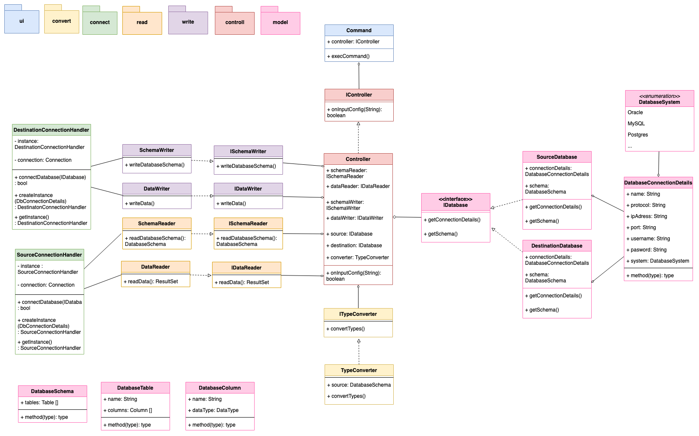
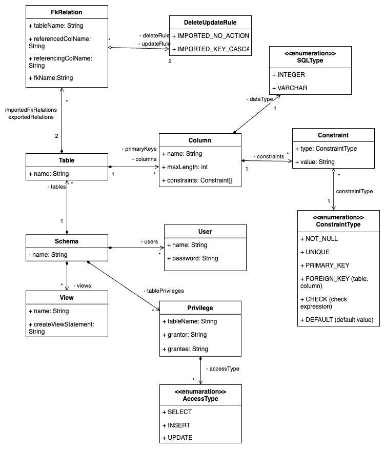
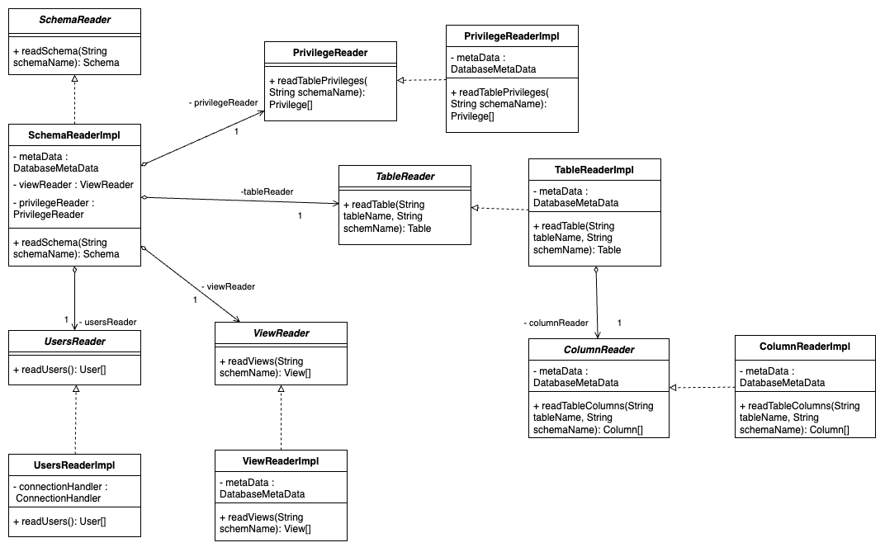

# 5.1 Bausteinsicht

[TOC]

### Bausteinsicht - overview (veraltet)

Folgendes Klassendiagramm zeigt die grobe Bausteinsicht der kompletten Anwendung zu Beginn der Entwicklung. In der Implementierungsphase wurde an einigen Stellen davon abgewichen.

----

### Bausteinsicht - read 

####  Model

Folgendes Diagramm zeigt die Model Klassen und deren Beziehungen des read schema packages.  

#### Logic

Folgendes Diagramm zeigt die Logik Klassen und deren Beziehungen des read schema packages.  

